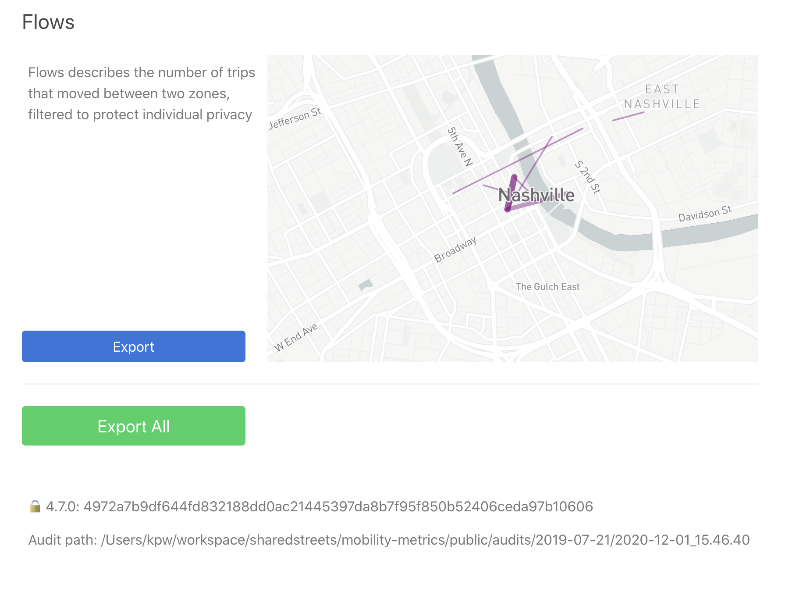
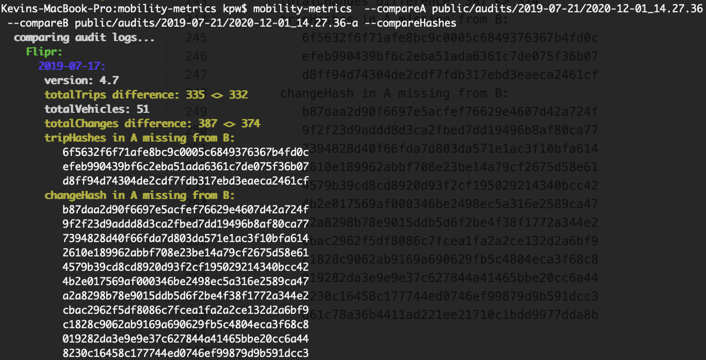

# Mobility Metrics
---

SharedStreets Mobility Metrics is an open source command line interface (CLI) and frontend for ingestion and analysis of Mobility Data Specification (MDS) mobility data. It is capable of reading raw MDS and aggregating useful & privacy-protecting metrics for longterm storage and analysis. Raw data is not persisted after aggregation.

# Metrics

## Summary:

**Total vehicles:** Total number of vehicles that were on the street at any time during the specified day. This includes all vehicles that were available, unavailable or reserved according to the event types specified here.

**Active vehicles:** Total number of vehicles that completed at least one trip during the specified day. (Trips)

**Total trips:** Total number of trips taken throughout the specified day.

**Total trips distance:** Total miles traveled by any vehicles throughout the specified day. (trip_distance)

**Vehicle Utilization:** Percentage of vehicles that were active over the course of a day.

**Average distance per vehicle:** Total trips distance, divided by active vehicles

**Average trips per active vehicle:** Total trips, divided by active vehicles

**Average trip distance:** Total trips distance, divided by total trips

**Average trip duration:** Total trips duration, divided by total trips

## Fleet:

**Available:** Vehicles deployed and ready to be activated by a rider
**Unvailable:** Vehicles deployed but unable to start a trip (awaiting maintinence, depleted battery, etc.)
**Reserved:** Vehicles actively engaged in a trip

## Geographic Time Filtered:

Each time filtered metric metric is aggregated by street, by hexbin, and optionally by custom polygon zones.

**Trip Volume:** The number of vehicles that moved over a street or in a zone during the time window specified.

**Availability:** The maximum number of vehicles that were available to users during the time window specified.

**On-street:** The maximum number of vehicles that are on the street and available or unavailable during the time window specified.

**Pickups:** The total number of trips that began during a time window

**Dropoffs:** The total number of trips that ended during a time window

**Flows:** The number of trips that went from one area of the city to another area of the city, sometimes referred to as origin/destination data or “O/D pairs”

## Requirements

- OSX or Linux (docker or WSL is recommended for Windows users)
- Node.js v11
- Valid MDS credentials for at least one live MDS Provider API supporting MDS v0.3 or higher

## API

### GET /data/{YYYY-MM-DD}/{provider}

Returns raw metrics data for a provider for the specified day. This endpoint is used by the frontend, and can be used to power alternate UIs or scripted analysis.

### GET /reports/{YYYY-MM-DD}/{provider}

Serves an html report that visualizes the metrics data for the specified day using maps, charts, and summaries.


## Install

Setup project and install dependencies.

```sh
npm install -g mobility-metrics
```

## Configuration

A `config.json` file is required to run Mobility Metrics. Enable providers and set credentials through this file. This file is used to store access tokens - **handle with care, these tokens are sensitive!**. See the config file in `/example/example.json` for a working example.

### Options

- `boundary`
  - a GeoJSON bounding box array used for downloading the street network for matching
- `center`
  - default map center represented as a coordinate array
- `zoom`
  - default map zoom level
- `privacyMinimum`
  - minimum unique record count for geographic trip volumes and origin destination flows
- `lost`
  - maximum number of days without status change before vehicles are permanently lost
- `summary`
  - enabled or disabled metrics in summary UI
- `vehicleFilter`
  - optionally allow only one type of [MDS vehicle_type](https://github.com/openmobilityfoundation/mobility-data-specification/tree/dev/provider#vehicle-types)
- `geographicFilter`
  - filter all data that falls outside the defined geographic filter, formatted as a valid GeoJSON Feature of type Polygon or MultiPolygon
- `providers`
  - list of providers to query
    - `type`
      - "local" for data off disk or "mds" for data off MDS provider API
    - `version`
      - sets the version of MDS to target; defaults to 0.2, but to use 0.3, set version to "0.3"
    - `trips`
      - URI of trip data
    - `status_changes`
      - URI of status change event feed
    - `token`
      - token for MDS API; blank if local
    - `enabled`
      - true or false
- `zones`
  - optional GeoJSON FeatureCollection of Polygons and/or MultiPolygon with a unique property named `id`

## Provider types

In your config.json file, each provider can be one of two types:

- "mds"
  - Standard MDS endpoint
  - "trips" and "status_changes" represent HTTP endpoints
- "local"
  - "trips" and "status_changes" represent file paths with line delimited MDS data

## CLI

The CLI is responsible for downloading raw data, running aggregation and reports, then deleting the raw cache. Configure this command in cron for automated daily imports.

### Flags

The following flags are required to run mobility-metrics.

- `--config`
  - path to configuration JSON file
- `--public`
  - path to directory where data and dashboard will be written
- `--cache`
  - path to temporary directory where raw data will be cached during aggregation (cache is automatically deleted after aggregation)
- `--startDay`
  - Beginning date of query range
- `--endDay`
  - End date of query range - should match `startDay` to query a single day of data
- `--reportDay`
  - Date used for report titles - does not need to match query dates

#### Optional

- `--version`
  - Get the mobility-metrics binary version

#### Auditing

  Run Mobility Metrics data auditing functions to compare source data used for reports (see Auditing section below for additiona information).

  - `--compareA`
    - Path to auditing directory for report A
  - `--compareB`
    - Path to auditing directory for report B
  - `--compareHashes`
    - Run hash comparison between report A and B


### Example

```sh
mobility-metrics \
  --config ./example/example.json \
  --public ./public \
  --cache ./cache \
  --startDay 2019-07-20 \
  --endDay 2019-07-20 \
  --reportDay 2019-07-20
```

## Version

To check the version of the CLI you are running, use the `-v` or `--version` flags.

## Docker

Docker is supported, and is recommended when installation is challenging on bespoke systems that fail when installing dependencies, such as OSRM.

### Building a docker image

```sh
# clone repo
git clone git@github.com:sharedstreets/mobility-metrics.git
cd mobility-metrics

# build image
docker build --tag mobility-metrics-image .
```

### Running mobility-metrics from docker image

Once you have a docker image built, use mobility-metrics CLI from within the image using `docker run`. In this example, a config file exists in the current directory, which mobility-metrics can read using the mounted volume.

```sh
docker run -it --rm \
-v $PWD:/data/ \ # mount current working directory to image volume
mobility-metrics-image \
  mobility-metrics \
    --config /data/config.json \
    --public /data/public \
    --cache /data/cache \
    --startDay 2019-09-20 \
    --endDay 2019-09-20 \
    --reportDay 2019-09-20;
```

## Serving API

The metrics data and reports generated by the mobility-metrics CLI are intended to be served from a static HTTP server, such as apache, nginx, or a public HTTP service like netifly or Github Pages. See the gh-pages branch of this repository to see how the demo for this tool is hosted using simulated data in Nashville, TN.

For a simple demonstration, the node module `serve` can be used to test out a configuration:

```
npm install -g serve
mobility-metrics --config ./example/example.json --public ./public --cache ./cache --day 2019-07-20
serve ./public
open http://localhost:5000/reports/2019-07-20/All
```

## Example

An example is provided in this repository for testing out mobility-metrics UI and aggregations. The example provides ready to use scripts that simulate MDS telemetry using an multi-agent model with the SharedStreets trip-simulator tool. Install the following requirements to get started:

- trip-simulator
- osmium
- curl
- osrm

To run the simulation, use the following script:

```sh
node example/simulate.js
```

Now that you have raw simulated MDS data to work with, run a backfill using the mobility-metrics CLI:

```sh
mobility-metrics --config ./example/example.json --public ./public --cache ./cache --day 2019-07-20
```

A full static file structure should be generated at `./public`. See the _Serving API_ section above for tips on serving this endpoint over HTTP.

## Auditing

Mobility Metrics version +4.7.x implements data auditing functionality that allows fine-grain comparison of source data used in reports generated for similar or overlapping time periods. This allows debugging of source data to ensure metrics differences are not the result of underlying data integrity problems. When a report is run Mobility Metrics stores auditing logs in `./auditing` alongside the report data. This audit log contains summary stats about the input data as well as a complete set irreversible hashes for each input trip and status_change event. When a data audit is performed, the logs from from each report are compared and differences are flagged.

The audit log directory path for each report is listed at the bottom of the report page:



Example of using the comparison command line tools to compare audit logs:

```
$ mobility-metrics  --compareA path/to/audit_log_a/ --compareA path/to/audit_log_b/
```


To compare individual hashes use the optional `--compareHashes` flag:

```
$ mobility-metrics --compareA path/to/audit_log_a/ --compareA path/to/audit_log_b/ --compareHashes
```




## Test

Run a test suite across the project. Auto-formats code using linter.

```sh
npm test
```

## Lint

Runs a linter, prettier, and auto-formats code to meet consistent style, while checking for syntax errors.

```sh
npm run lint
```
